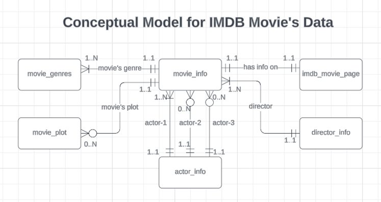

# Data Engineering Project: End-to-End Data Modelling ETL and Visualization

# Dataset

IMDB Movie Dataset contains about 5000 movies with around 28 attributes, including the director, actors, and plot of the movie. The dataset has scope of cleaning data, 1NF, 2NF, 3NF, NULLs, creating ETL scripts and good visualisation.

# Cleaning of Dataset:

Dataset has been studied and it require cleaning before imported to SQL Server. Following cleaning activities will be performed on data using Tableau Prep as first step:

- **Handling null values**
  - **Removed rows with missing title_year, actor_1_name, or duration:**
  Missing values in three important columns title_year, actor_1_name, or duration, need cleaning. Although there are many mechanisms to handle missing values, however, keeping the normalization requirement these records are been removed.

  - **Filling missing country to USA:**
  There is only one record with missing country after removing missing data rows. After searching over internet, it is verified that country for this movie was USA, so, one record modified accordingly.

- **Remove all non-ASCII characters:**
  It is found that few non-ASCII characters been added at end of each movie title, that in not making any value addition, removing all non-ASCII characters from dataset.

- **Cleaning same movie rows with minor differences:**
  It is found that there exist almost similar records. Such records have almost same value for categorical variables and very minor difference in numerical fields like facebook likes etc. Such records are considered as dirty, and have been removed from dataset. Removing these records will not loss any information.

- **Cleaning specific record for movie 'Ben-Hur':**
  There are 3 records for same movie 'Ben-Hur', where one record doesn't contain plot_keywords, and others differ in only few like numbers. Removed record with missing plot_keywords.

- **Cleaning specific record for movie 'Brothers':**
  There are 2 records for same movie 'Brothers', where records contain different actor_3_name and actor_3_facebook_likes. It is assumed that actor with higher actor_3_facebook_likes as 3rd main actor for movie, which is 'Bailee Madison'.

**Important points regarding Final Dataset are:**

- 249 records out of 5043 are removed from dataset. There were less than 127 records, that are removed due to cleaning issue, which is approximately 2.5% of total rows. Rest records are duplicate.
- Modified dataset contains 4794 records and 28 attributes.
- 14 columns out of 28 contains null values, however, missing values are less and not been ignored.
- There are cases where duplicate movie name exists, this is because same movie name being used in different release year.

**Why Data is in Zero-NF?**

For a dataset to be in 1NF, each and every cell in dataset should have atomic identifiable value. However, in the IMDB dataset two columns’ genres and plot_keywords contain multiple values separated with ‘|’ (pipe). For this reason, dataset is in Zero-NF.

# Phase-1
## Dataset in Zero-NF:

All the columns in datasets are given an alphanumeric code for normalization process and are listed below:

(A1) movie_title

(A2) title_year

(A3) genres

(B) color(\*)

(C) aspect_ratio(\*)

(D) duration

(E) language(\*)

(F) country

(G) plot_keywords(\*)

(H) budget(\*)

(I) gross(\*)

(J) movie_facebook_likes

(K) cast_total_facebook_likes

(L) movie_imdb_link

(M) facenumber_in_poster(\*)

(N) content_rating(\*)

(O) num_critic_for_reviews(\*)

(P) num_user_for_reviews(\*)

(Q) num_voted_users

(R) imdb_score

(S) director_name

(T) director_facebook_likes

(U) actor_1_name

(V) actor_1_facebook_likes

(W) actor_2_name(\*)

(X) actor_2_facebook_likes(\*)

(Y) actor_3_name(\*)

(Z) actor_3_facebook_likes(\*)

## Find all functional dependencies, minimum cover and normalize the datasets to the 3NF:

### Normalization to 1NF:

There exist multiple methods to convert data to 1NF. We will be using below two methods in normalization process from Zero-NF to 1NF in our project:

- Creating duplicate records will distribute the atomic values from one cell to multiple rows, and thus will create dataset that will be in 1NF. For column ‘genres’ in dataset, this approach is being used.
- Creating separate table will remove the column with non-atomic value and keep only reference in source table, and thus will create dataset that will be in 1NF. For column ‘plot_keywords’ in dataset, this approach is being used.

### Dataset in 1NF:

{**A1, A2, G**}

{**A1, A2, A3**, B, C, D, E, F, H, I, J, L, M, L, N, O, P, Q, R, S, T, U, V, W, X, Y, Z}

## Functional Dependencies:

| **Description** | **Relations** |
| --- | --- |
| (A1) movie_title, (A2) title_year, and (G) plot_keywords are only attributes in first table, and doesn’t derive any other attribute. | (A1, A2, G) 🡪 {} |
| (A1) movie_title, (A2) title_year, and (A3) genres can be used to determine all other attributes in second table. | (A1, A2, A3) 🡪 {B, C, D, E, F, H, I, J, K, L, M, N, O, P, Q, R, S, T, U, V, W, X, Y, Z} |
| (A1) movie_title, (A2) title_year, and (L) movie_imdb_link can be used to determine all other attributes except (A3) genres in second table. | (A1, A2, L) 🡪 {B, C, D, E, F, H, I, J, K, M, N, O, P, Q, R, S, T, U, V, W, X, Y, Z} |
| (A1) movie_title, and (A2) title_year can be used to determine all other attributes except (A3) genres in second table. | (A1, A2) 🡪 {B, C, D, E, F, H, I, J, K, L, M, N, O, P, Q, R, S, T, U, V, W, X, Y, Z} |
| (L) movie_imdb_link can only be used to determine all other attributes except (A3) genres in second table. | (L) 🡪 {A1, A2, B, C, D, E, F, H, I, J, K, L, M, N, O, P, Q, R, S, T, U, V, W, X, Y, Z} |
| (A1) movie_title, (A2) title_year, (A3) genres, and (L) movie_imdb_link can be used to determine all other attributes in second table. | (A1, A2, A3, L) 🡪 {B, C, D, E, F, H, I, J, K, M, N, O, P, Q, R, S, T, U, V, W, X, Y, Z} |
| (S) director_name can be used to determine (T) director_facebook_likes. | (S) 🡪 {T} |
| (U) actor_1_name can be used to determine (V) actor_1_facebook_likes. | (U) 🡪 {V} |
| (W) actor_2_name can be used to determine (X) actor_2_facebook_likes. | (W) 🡪 {X} |
| (Y) actor_3_name can be used to determine (Z) actor_3_facebook_likes. | (Y) 🡪 {Z} |

## Minimum cover:

<table><tbody><tr><th>
<strong>Step 1</strong>
</th><th>
<strong>Step 2</strong>
</th><th>
<strong>Step 3</strong>
</th><th>
<strong>Step 4</strong>
</th></tr><tr><td>
<strong>Remove Trivial FD</strong>
</td><td>
<strong>Reduce Right Side</strong>
</td><td>
<strong>Reduce Left Side</strong>
</td><td>
<strong>Eliminate Redundancy</strong>
</td></tr><tr><td>
<strong>No Change</strong>
</td><td></td><td></td><td>
<strong>Read NOTE (*)</strong>
</td></tr><tr><td><ol><li>(A1, A2, G) 🡪 {}</li><li>(A1, A2, A3) 🡪 {B, C, D, E, F, H, I, J, K, L, M, N, O, P, Q, R, S, T, U, V, W, X, Y, Z}</li><li>(A1, A2, L) 🡪 {B, C, D, E, F, H, I, J, K, M, N, O, P, Q, R, S, T, U, V, W, X, Y, Z}</li><li>(A1, A2) 🡪 {B, C, D, E, F, H, I, J, K, L, M, N, O, P, Q, R, S, T, U, V, W, X, Y, Z}</li><li>(L) 🡪 {A1, A2, B, C, D, E, F, H, I, J, K, L, M, N, O, P, Q, R, S, T, U, V, W, X, Y, Z}</li><li>(A1, A2, A3, L) 🡪 {B, C, D, E, F, H, I, J, K, M, N, O, P, Q, R, S, T, U, V, W, X, Y, Z}</li><li>(S) 🡪 {T}</li><li>(U) 🡪 {V}</li><li>(W) 🡪 {X}</li><li>(Y) 🡪 {Z}</li></ol></td><td><ol><li>(A1, A2, G) 🡪 {}</li><li>(A1, A2, A3) 🡪 B</li><li>(A1, A2, A3) 🡪 C</li><li>(A1, A2, A3) 🡪 D</li><li>(A1, A2, A3) 🡪 E</li><li>(A1, A2, A3) 🡪 F</li><li>(A1, A2, A3) 🡪 H</li><li>(A1, A2, A3) 🡪 I</li><li>(A1, A2, A3) 🡪 J</li><li>(A1, A2, A3) 🡪 K</li><li>(A1, A2, A3) 🡪 L</li><li>(A1, A2, A3) 🡪 M</li><li>(A1, A2, A3) 🡪 N</li><li>(A1, A2, A3) 🡪 O</li><li>(A1, A2, A3) 🡪 P</li><li>(A1, A2, A3) 🡪 Q</li><li>(A1, A2, A3) 🡪 R</li><li>(A1, A2, A3) 🡪 S</li><li>(A1, A2, A3) 🡪 T</li><li>(A1, A2, A3) 🡪 U</li><li>(A1, A2, A3) 🡪 V</li><li>(A1, A2, A3) 🡪 W</li><li>(A1, A2, A3) 🡪 X</li><li>(A1, A2, A3) 🡪 Y</li><li>(A1, A2, A3) 🡪 Z</li><li>(A1, A2, L) 🡪 B</li><li>(A1, A2, L) 🡪 C</li><li>(A1, A2, L) 🡪 D</li><li>(A1, A2, L) 🡪 E</li><li>(A1, A2, L) 🡪 F</li><li>(A1, A2, L) 🡪 H</li><li>(A1, A2, L) 🡪 I</li><li>(A1, A2, L) 🡪 J</li><li>(A1, A2, L) 🡪 K</li><li>(A1, A2, L) 🡪 M</li><li>(A1, A2, L) 🡪 N</li><li>(A1, A2, L) 🡪 O</li><li>(A1, A2, L) 🡪 P</li><li>(A1, A2, L) 🡪 Q</li><li>(A1, A2, L) 🡪 R</li><li>(A1, A2, L) 🡪 S</li><li>(A1, A2, L) 🡪 T</li><li>(A1, A2, L) 🡪 U</li><li>(A1, A2, L) 🡪 V</li><li>(A1, A2, L) 🡪 W</li><li>(A1, A2, L) 🡪 X</li><li>(A1, A2, L) 🡪 Y</li><li>(A1, A2, L) 🡪 Z</li><li>(A1, A2) 🡪 B</li><li>(A1, A2) 🡪 C</li><li>(A1, A2) 🡪 D</li><li>(A1, A2) 🡪 E</li><li>(A1, A2) 🡪 F</li><li>(A1, A2) 🡪 H</li><li>(A1, A2) 🡪 I</li><li>(A1, A2) 🡪 J</li><li>(A1, A2) 🡪 K</li><li>(A1, A2) 🡪 L</li><li>(A1, A2) 🡪 M</li><li>(A1, A2) 🡪 N</li><li>(A1, A2) 🡪 O</li><li>(A1, A2) 🡪 P</li><li>(A1, A2) 🡪 Q</li><li>(A1, A2) 🡪 R</li><li>(A1, A2) 🡪 S</li><li>(A1, A2) 🡪 T</li><li>(A1, A2) 🡪 U</li><li>(A1, A2) 🡪 V</li><li>(A1, A2) 🡪 W</li><li>(A1, A2) 🡪 X</li><li>(A1, A2) 🡪 Y</li><li>(A1, A2) 🡪 Z</li><li>(L) 🡪 A1</li><li>(L) 🡪 A2</li><li>(L) 🡪 B</li><li>(L) 🡪 C</li><li>(L) 🡪 D</li><li>(L) 🡪 E</li><li>(L) 🡪 F</li><li>(L) 🡪 H</li><li>(L) 🡪 I</li><li>(L) 🡪 J</li><li>(L) 🡪 K</li><li>(L) 🡪 M</li><li>(L) 🡪 N</li><li>(L) 🡪 O</li><li>(L) 🡪 P</li><li>(L) 🡪 Q</li><li>(L) 🡪 R</li><li>(L) 🡪 S</li><li>(L) 🡪 T</li><li>(L) 🡪 U</li><li>(L) 🡪 V</li><li>(L) 🡪 W</li><li>(L) 🡪 X</li><li>(L) 🡪 Z</li><li>(A1,A2,A3,L) 🡪 B</li><li>(A1,A2,A3,L) 🡪 C</li><li>(A1,A2,A3,L) 🡪 D</li><li>(A1,A2,A3,L) 🡪 E</li><li>(A1,A2,A3,L) 🡪 F</li><li>(A1,A2,A3,L) 🡪 H</li><li>(A1,A2,A3,L) 🡪 I</li><li>(A1,A2,A3,L) 🡪 J</li><li>(A1,A2,A3,L) 🡪 K</li><li>(A1,A2,A3,L) 🡪 M</li><li>(A1,A2,A3,L) 🡪 N</li><li>(A1,A2,A3,L) 🡪 O</li><li>(A1,A2,A3,L) 🡪 P</li><li>(A1,A2,A3,L) 🡪 Q</li><li>(A1,A2,A3,L) 🡪 R</li><li>(A1,A2,A3,L) 🡪 S</li><li>(A1,A2,A3,L) 🡪 T</li><li>(A1,A2,A3,L) 🡪 U</li><li>(A1,A2,A3,L) 🡪 V</li><li>(A1,A2,A3,L) 🡪 W</li><li>(A1,A2,A3,L) 🡪 X</li><li>(A1,A2,A3,L) 🡪 Y</li><li>(A1,A2,A3,L) 🡪 Z</li><li>(S) 🡪 T</li><li>(U) 🡪 V</li><li>(W) 🡪 X</li><li>(Y) 🡪 Z</li></ol></td><td><ol><li>(A1, A2, G) 🡪 {}</li><li>(A1, A2, A3) 🡪 {}</li><li>(A1, A2) 🡪 B</li><li>(A1, A2) 🡪 C</li><li>(A1, A2) 🡪 D</li><li>(A1, A2) 🡪 E</li><li>(A1, A2) 🡪 F</li><li>(A1, A2) 🡪 H</li><li>(A1, A2) 🡪 I</li><li>(A1, A2) 🡪 J</li><li>(A1, A2) 🡪 K</li><li>(A1, A2) 🡪 L</li><li>(A1, A2) 🡪 M</li><li>(A1, A2) 🡪 N</li><li>(A1, A2) 🡪 O</li><li>(A1, A2) 🡪 P</li><li>(A1, A2) 🡪 Q</li><li>(A1, A2) 🡪 R</li><li>(A1, A2) 🡪 S</li><li>(A1, A2) 🡪 T</li><li>(A1, A2) 🡪 U</li><li>(A1, A2) 🡪 V</li><li>(A1, A2) 🡪 W</li><li>(A1, A2) 🡪 X</li><li>(A1, A2) 🡪 Y</li><li>(A1, A2) 🡪 Z</li><li>(A1, A2) 🡪 B</li><li>(A1, A2) 🡪 C</li><li>(A1, A2) 🡪 D</li><li>(A1, A2) 🡪 E</li><li>(A1, A2) 🡪 F</li><li>(A1, A2) 🡪 H</li><li>(A1, A2) 🡪 I</li><li>(A1, A2) 🡪 J</li><li>(A1, A2) 🡪 K</li><li>(A1, A2) 🡪 M</li><li>(A1, A2) 🡪 N</li><li>(A1, A2) 🡪 O</li><li>(A1, A2) 🡪 P</li><li>(A1, A2) 🡪 Q</li><li>(A1, A2) 🡪 R</li><li>(A1, A2) 🡪 S</li><li>(A1, A2) 🡪 T</li><li>(A1, A2) 🡪 U</li><li>(A1, A2) 🡪 V</li><li>(A1, A2) 🡪 W</li><li>(A1, A2) 🡪 X</li><li>(A1, A2) 🡪 Y</li><li>(A1, A2) 🡪 Z</li><li>(L) 🡪 B</li><li>(L) 🡪 C</li><li>(L) 🡪 D</li><li>(L) 🡪 E</li><li>(L) 🡪 F</li><li>(L) 🡪 H</li><li>(L) 🡪 I</li><li>(L) 🡪 J</li><li>(L) 🡪 K</li><li>(L) 🡪 M</li><li>(L) 🡪 N</li><li>(L) 🡪 O</li><li>(L) 🡪 P</li><li>(L) 🡪 Q</li><li>(L) 🡪 R</li><li>(L) 🡪 S</li><li>(L) 🡪 T</li><li>(L) 🡪 U</li><li>(L) 🡪 V</li><li>(L) 🡪 W</li><li>(L) 🡪 X</li><li>(L) 🡪 Y</li><li>(L) 🡪 Z</li><li>(A1, A2) 🡪 B</li><li>(A1, A2) 🡪 C</li><li>(A1, A2) 🡪 D</li><li>(A1, A2) 🡪 E</li><li>(A1, A2) 🡪 F</li><li>(A1, A2) 🡪 H</li><li>(A1, A2) 🡪 I</li><li>(A1, A2) 🡪 J</li><li>(A1, A2) 🡪 K</li><li>(A1, A2) 🡪 L</li><li>(A1, A2) 🡪 M</li><li>(A1, A2) 🡪 N</li><li>(A1, A2) 🡪 O</li><li>(A1, A2) 🡪 P</li><li>(A1, A2) 🡪 Q</li><li>(A1, A2) 🡪 R</li><li>(A1, A2) 🡪 S</li><li>(A1, A2) 🡪 T</li><li>(A1, A2) 🡪 U</li><li>(A1, A2) 🡪 V</li><li>(A1, A2) 🡪 W</li><li>(A1, A2) 🡪 X</li><li>(A1, A2) 🡪 Y</li><li>(A1, A2) 🡪 Z</li><li>(L) 🡪 A1</li><li>(L) 🡪 A2</li><li>(L) 🡪 B</li><li>(L) 🡪 C</li><li>(L) 🡪 D</li><li>(L) 🡪 E</li><li>(L) 🡪 F</li><li>(L) 🡪 H</li><li>(L) 🡪 I</li><li>(L) 🡪 J</li><li>(L) 🡪 K</li><li>(L) 🡪 M</li><li>(L) 🡪 N</li><li>(L) 🡪 O</li><li>(L) 🡪 P</li><li>(L) 🡪 Q</li><li>(L) 🡪 R</li><li>(L) 🡪 S</li><li>(L) 🡪 T</li><li>(L) 🡪 U</li><li>(L) 🡪 V</li><li>(L) 🡪 W</li><li>(L) 🡪 X</li><li>(L) 🡪 Y</li><li>(L) 🡪 Z</li><li>(A1, A2) 🡪 B</li><li>(A1, A2) 🡪 C</li><li>(A1, A2) 🡪 D</li><li>(A1, A2) 🡪 E</li><li>(A1, A2) 🡪 F</li><li>(A1, A2) 🡪 H</li><li>(A1, A2) 🡪 I</li><li>(A1, A2) 🡪 J</li><li>(A1, A2) 🡪 K</li><li>(A1, A2) 🡪 M</li><li>(A1, A2) 🡪 N</li><li>(A1, A2) 🡪 O</li><li>(A1, A2) 🡪 P</li><li>(A1, A2) 🡪 Q</li><li>(A1, A2) 🡪 R</li><li>(A1, A2) 🡪 S</li><li>(A1, A2) 🡪 T</li><li>(A1, A2) 🡪 U</li><li>(A1, A2) 🡪 V</li><li>(A1, A2) 🡪 W</li><li>(A1, A2) 🡪 X</li><li>(A1, A2) 🡪 Y</li><li>(A1, A2) 🡪 Z</li><li>(L) 🡪 B</li><li>(L) 🡪 C</li><li>(L) 🡪 D</li><li>(L) 🡪 E</li><li>(L) 🡪 F</li><li>(L) 🡪 H</li><li>(L) 🡪 I</li><li>(L) 🡪 J</li><li>(L) 🡪 K</li><li>(L) 🡪 M</li><li>(L) 🡪 N</li><li>(L) 🡪 O</li><li>(L) 🡪 P</li><li>(L) 🡪 Q</li><li>(L) 🡪 R</li><li>(L) 🡪 S</li><li>(L) 🡪 T</li><li>(L) 🡪 U</li><li>(L) 🡪 V</li><li>(L) 🡪 W</li><li>(L) 🡪 X</li><li>(L) 🡪 Y</li><li>(L) 🡪 Z</li><li>(S) 🡪 T</li><li>(U) 🡪 V</li><li>(W) 🡪 X</li><li>(Y) 🡪 Z</li></ol></td><td><ol><li>(A1, A2, G) 🡪 {}</li><li>(A1, A2, A3) 🡪 {}</li><li>(A1, A2) 🡪 B</li><li>(A1, A2) 🡪 C</li><li>(A1, A2) 🡪 D</li><li>(A1, A2) 🡪 E</li><li>(A1, A2) 🡪 F</li><li>(A1, A2) 🡪 H</li><li>(A1, A2) 🡪 I</li><li>(A1, A2) 🡪 J</li><li>(A1, A2) 🡪 K</li><li><s>(A1, A2) 🡪 J</s></li><li><s>(A1, A2) 🡪 M</s></li><li><s>(A1, A2) 🡪 N</s></li><li><s>(A1, A2) 🡪 O</s></li><li><s>(A1, A2) 🡪 P</s></li><li><s>(A1, A2) 🡪 Q</s></li><li><s>(A1, A2) 🡪 R</s></li><li>(A1, A2) 🡪 S</li><li><s>(A1, A2) 🡪 T</s></li><li>(A1, A2) 🡪 U</li><li><s>(A1, A2) 🡪 V</s></li><li>(A1, A2) 🡪 W</li><li><s>(A1, A2) 🡪 X</s></li><li>(A1, A2) 🡪 Y</li><li><s>(A1, A2) 🡪 Z</s></li><li><s>(A1, A2) 🡪 B</s></li><li><s>(A1, A2) 🡪 C</s></li><li><s>(A1, A2) 🡪 D</s></li><li><s>(A1, A2) 🡪 E</s></li><li><s>(A1, A2) 🡪 F</s></li><li><s>(A1, A2) 🡪 H</s></li><li><s>(A1, A2) 🡪 I</s></li><li><s>(A1, A2) 🡪 J</s></li><li><s>(A1, A2) 🡪 K</s></li><li><s>(A1, A2) 🡪 M</s></li><li><s>(A1, A2) 🡪 N</s></li><li><s>(A1, A2) 🡪 O</s></li><li><s>(A1, A2) 🡪 P</s></li><li><s>(A1, A2) 🡪 Q</s></li><li><s>(A1, A2) 🡪 R</s></li><li><s>(A1, A2) 🡪 S</s></li><li><s>(A1, A2) 🡪 T</s></li><li><s>(A1, A2) 🡪 U</s></li><li><s>(A1, A2) 🡪 V</s></li><li><s>(A1, A2) 🡪 W</s></li><li><s>(A1, A2) 🡪 X</s></li><li><s>(A1, A2) 🡪 Y</s></li><li><s>(A1, A2) 🡪 Z</s></li><li><s>(L) 🡪 B</s></li><li><s>(L) 🡪 C</s></li><li><s>(L) 🡪 D</s></li><li><s>(L) 🡪 E</s></li><li><s>(L) 🡪 F</s></li><li><s>(L) 🡪 H</s></li><li><s>(L) 🡪 I</s></li><li><s>(L) 🡪 J</s></li><li><s>(L) 🡪 K</s></li><li>(L) 🡪 M</li><li>(L) 🡪 N</li><li>(L) 🡪 O</li><li>(L) 🡪 P</li><li>(L) 🡪 Q</li><li>(L) 🡪 R</li><li><s>(L) 🡪 S</s></li><li><s>(L) 🡪 T</s></li><li><s>(L) 🡪 U</s></li><li><s>(L) 🡪 V</s></li><li><s>(L) 🡪 W</s></li><li><s>(L) 🡪 X</s></li><li><s>(L) 🡪 Y</s></li><li><s>(L) 🡪 Z</s></li><li><s>(A1, A2) 🡪 B</s></li><li><s>(A1, A2) 🡪 C</s></li><li><s>(A1, A2) 🡪 D</s></li><li><s>(A1, A2) 🡪 E</s></li><li><s>(A1, A2) 🡪 F</s></li><li><s>(A1, A2) 🡪 H</s></li><li><s>(A1, A2) 🡪 I</s></li><li><s>(A1, A2) 🡪 J</s></li><li><s>(A1, A2) 🡪 K</s></li><li>(A1, A2) 🡪 L</li><li><s>(A1, A2) 🡪 M</s></li><li><s>(A1, A2) 🡪 N</s></li><li><s>(A1, A2) 🡪 O</s></li><li><s>(A1, A2) 🡪 P</s></li><li><s>(A1, A2) 🡪 Q</s></li><li><s>(A1, A2) 🡪 R</s></li><li><s>(A1, A2) 🡪 S</s></li><li><s>(A1, A2) 🡪 T</s></li><li><s>(A1, A2) 🡪 U</s></li><li><s>(A1, A2) 🡪 V</s></li><li><s>(A1, A2) 🡪 W</s></li><li><s>(A1, A2) 🡪 X</s></li><li><s>(A1, A2) 🡪 Y</s></li><li><s>(A1, A2) 🡪 Z</s></li><li><s>(L) 🡪 A1</s></li><li><s>(L) 🡪 A2</s></li><li><s>(L) 🡪 B</s></li><li><s>(L) 🡪 C</s></li><li><s>(L) 🡪 D</s></li><li><s>(L) 🡪 E</s></li><li><s>(L) 🡪 F</s></li><li><s>(L) 🡪 H</s></li><li><s>(L) 🡪 I</s></li><li><s>(L) 🡪 J</s></li><li><s>(L) 🡪 K</s></li><li><s>(L) 🡪 M</s></li><li><s>(L) 🡪 N</s></li><li><s>(L) 🡪 O</s></li><li><s>(L) 🡪 P</s></li><li><s>(L) 🡪 Q</s></li><li><s>(L) 🡪 R</s></li><li><s>(L) 🡪 S</s></li><li><s>(L) 🡪 T</s></li><li><s>(L) 🡪 U</s></li><li><s>(L) 🡪 V</s></li><li><s>(L) 🡪 W</s></li><li><s>(L) 🡪 X</s></li><li><s>(L) 🡪 Y</s></li><li><s>(L) 🡪 Z</s></li><li><s>(A1, A2) 🡪 B</s></li><li><s>(A1, A2) 🡪 C</s></li><li><s>(A1, A2) 🡪 D</s></li><li><s>(A1, A2) 🡪 E</s></li><li><s>(A1, A2) 🡪 F</s></li><li><s>(A1, A2) 🡪 H</s></li><li><s>(A1, A2) 🡪 I</s></li><li><s>(A1, A2) 🡪 J</s></li><li><s>(A1, A2) 🡪 K</s></li><li><s>(A1, A2) 🡪 M</s></li><li><s>(A1, A2) 🡪 N</s></li><li><s>(A1, A2) 🡪 O</s></li><li><s>(A1, A2) 🡪 P</s></li><li><s>(A1, A2) 🡪 Q</s></li><li><s>(A1, A2) 🡪 R</s></li><li><s>(A1, A2) 🡪 S</s></li><li><s>(A1, A2) 🡪 T</s></li><li><s>(A1, A2) 🡪 U</s></li><li><s>(A1, A2) 🡪 V</s></li><li><s>(A1, A2) 🡪 W</s></li><li><s>(A1, A2) 🡪 X</s></li><li><s>(A1, A2) 🡪 Y</s></li><li><s>(A1, A2) 🡪 Z</s></li><li><s>(L) 🡪 B</s></li><li><s>(L) 🡪 C</s></li><li><s>(L) 🡪 D</s></li><li><s>(L) 🡪 E</s></li><li><s>(L) 🡪 F</s></li><li><s>(L) 🡪 H</s></li><li><s>(L) 🡪 I</s></li><li><s>(L) 🡪 J</s></li><li><s>(L) 🡪 K</s></li><li><s>(L) 🡪 M</s></li><li><s>(L) 🡪 N</s></li><li><s>(L) 🡪 O</s></li><li><s>(L) 🡪 P</s></li><li><s>(L) 🡪 Q</s></li><li><s>(L) 🡪 R</s></li><li><s>(L) 🡪 S</s></li><li><s>(L) 🡪 T</s></li><li><s>(L) 🡪 U</s></li><li><s>(L) 🡪 V</s></li><li><s>(L) 🡪 W</s></li><li><s>(L) 🡪 X</s></li><li><s>(L) 🡪 Y</s></li><li><s>(L) 🡪 Z</s></li><li>(S) 🡪 T</li><li>(U) 🡪 V</li><li>(W) 🡪 X</li><li>(Y) 🡪 Z</li></ol></td></tr></tbody></table>

**NOTE (\*):** Due to one-to-one correspondence between {(A1) movie_title, (A2) title_year} and { (L) movie_imdb_link}, we need to assume one as primary key, and another as candidate key. For simplicity it is assumed {(A1) movie_title, (A2) title_year} is kept as primary attribute. Also, the attributes primary dependent on movie_imdb_link web page are kept associated on same.

## Functional Dependency Diagram:

### Super key identification:

Super key for full dataset (whether in Zero-NF or any other normal form) is as follows:

**{(A1) movie_title, (A2) title_year, (A3) genres, (G) plot_keywords}**

Which is union of below two relations:

- Unique key for first relation is all three attributes i.e. {(A1) movie_title, (A2) title_year, (G) plot_keywords}, and
- Unique key for second relation is {(A1) movie_title, (A2) title_year, (A3) genres}.

## Converting relation to 2NF:

For a relation to be in 2NF, all non-keys attributes should be fully functionally dependent on primary key. Here, there exist attributes who are dependent on part of primary key, so final relation needs to be splitted in following relations based on part of key attributes are dependent: -

- R(**A1, A2, G**)
- R(**A1, A2, A3**)
- R(**A1, A2**, B, C, D, E, F, H, I, J, K, L, M, N, O, P, Q, R, S, T, U, V, W, X, Y, Z)

Now, above relation is in 2NF.

## Converting relation to 3NF:

Above relation is in 2NF, however it is not in 3NF because there exists a non-key attribute that transitively dependent on primary key. So, we need to further break the relation in below mentioned relations:

- R(**A1, A2, G**)
- R(**A1, A2, A3**)
- R(**A1, A2**, B, C, D, E, F, H, I, J, K, L, S, U, W, Y)
- R(**L**, M, N, O, P, Q, R)
- R(**S**, T)
- R(**U**, V)
- R(**W**, X)
- R(**Y**, Z)

Now relation is in 3NF.

### Create logical data model and ER

### Create physical data model for all entities

### Create DDL statement

[DDL Script File for all tables](./sqls/01_DDL_Script.sql)

# Phase-2

Phase-2 for project is performing transformation of source data to normalized data schema that was decided during phase-1. Approach decided for phase-2 is used for project is **ETL (extract, transform, and load)**. Overall architecture used for the project is represented as:

## Transformation Tableau Prep Flow:

Three stages of process in sequence includes:

### 1. Extract

Extraction includes connecting to connecting to source of data. In this case, it is csv file that contains the records for movies and characteristics like rating, budget, earning etc. The file is in Zero-NF, and includes dirty or uncleaned data.

**Screenshot of source connection:**

### 2. Transform

All transformation of data from source to target are performed at this stage. This process will populate the required tables in third normalisation form (3NF) that reside in target database on SQL server. List of all activities performed during transformation process are as follows:

#### 2.1. Cleaning of dataset (CleanUp_Stage)

Following cleanup activities are performed in CleanUp_Stage:

  1. Filtering null values for title_year, actor_1_name, and duration.
  2. Renaming field name from “duration” to “duration_in_mins”.
  3. Group null value in “country” column to “USA”.
  4. Trim spaces (cleanup) for column “movie_title”.
  5. Filtering duplicate movie records for “Ben-Hur” and “Brothers”.
  6. Calculated field “is_color” from existing column “color”.

**Screenshot:**

#### 2.2. Grouping of similar records (Group_SameRec):

In given uncleaned dataset, it is found that there exist almost similar records. Such records have same value for categorical variables like movie, year, actors, country ect. and very minor difference in numerical fields like facebook likes etc. Such records are considered as dirty, and have been removed from dataset. Removing these records will not loss any information.

##### Population of target tables:
##### Populating table actor_info:
###### Union of actor records from columns associated to actor 1, 2, and 3:

As there are three fields in datasets that are associated with actors, so values in all three fields need to be considered while populating actor_info table. This is because a same person can be actor_1 in one movie, and same can be actor_2 or actor_3 for some another movie. So, made union of three set of actor_info with ignoring null records.

###### Aggregation to match duplicate actors:

This set is required to ensure to deduplicate the actor_info. In event of two records with same name and little difference in facebook likes, maximum value is considered assuming latest one.

**Screenshot of union and merge:**

##### Populating table director_info:

Deduplication is performed by grouping director records in dataset.

##### Populating table imdb_movie_page:

Filter the columns that are required for table imdb_movie_page.

##### Populating table movie_info:

Filter the columns that are required for table movie_info. At this stage, we have also, renamed the column “is_color” to “color”.

##### Populating table movie_genres:

As, single movie can have more than one genre, therefore following activities are performed to make dataset suitable for database table population:

- Filtering of required columns only, i.e. movie_title, title_year and genres.
- Split column, genre to multiple columns based on delimiter (|).
- Pivoting the split columns to form rows.
##### Populating table movie_plot:

As, single movie can have more than one plot, therefore following activities are performed to make dataset suitable for database table population:

- Filtering of required columns only, i.e. movie_title, title_year and plot_keywords.
- Excluding any records with null plot_keywords.
- Split column, genre to multiple columns based on delimiter (|).
- Pivoting the split columns to form rows.

### Load

Load step involve populating the target tables directly. No changes or transformation will be performed at target system.

#### Execution of Tableau Prep Flow:

All the tables are required to be populated in below order to maintain referential integrity constraints in database design:

- actor_info
- director_info
- imdb_movie_page
- movie_info
- movie_genres
- movie_plot

#### Clearing dataset in SQL Server before re-execution of Tableau Prep Flow:

This step is important in case there is need to re-populate the tables through Tableau Prep. This is because of integrity constraints (foreign key) are applicable on database.

## Information of number of records

### Source
5,043 records \[IMDB_movie_dataset.csv\]

### After cleanup (through Tableau Prep.)
4,794 records \[Filtering null records, deduplicate records\]

### Target Normalized Tables

| **SN.** | **Table Name** | **Records** |
| --- | --- | --- |
| 1   | actor_info | 6,105 |
| 2   | director_info | 2,381 |
| 3   | imdb_movie_page | 4,794 |
| 4   | movie_info | 4,794 |
| 5   | movie_genres | 13,783 |
| 6   | movie_plot | 22,998 |

# Phase-3

## Purpose of Study and Analysis Questionnaires

As part of phase-3, two dashboards are created using Tableau Desktop. IMDB movies dataset contains data for 4,794 movies that to for period for 100 years (from 1916 to 2016). Through dashboards, following questions are tried to be answered:

- Which movie is best for the given period?
  - On basis of best IMDB score.
  - On basis of gross earning of the movie.
- Which actor is most followed by audience on Facebook?
  - Most followed Leading actor.
  - Most followed Supporting actor.
  - Most followed 2nd Supporting actor.
- Who is best Director?
  - Based on followers on Facebook.
  - Based on gross earning of the movie directed.
- List of director-actor duo with big movie budgets.
- Year wise popular movie-plots with most popular shown first.
- What is IMDB score distribution?
- Movie duration in minutes over the years.
- Language wise distribution of number of movies.
- List of actors most followed on Facebook with their count and comparison.
- Country-wise movies gross collection.
- Most liked genre over the years.

All the plots/charts are interlinked through filter-action and there is flexibility to change the range of years for which analysis is being performed.

## Screenshots of final dashboards

### Dashboard IMDB Movies Dataset Insights - 1

### Dashboard IMDB Movies Dataset Insights - 2

# Important Links
[Source Data - Uncleaned Zero Normalized Data](./source_data/IMDB_movie_dataset.csv)
[SQL - Zero Normalized Data Import Script](./sqls/00_0NF_Import_Data.sql)
[SQL - Data Definition Language Script](./sqls/01_DDL_Script.sql)
[Tableau Prep File](./tableau_files/00_PrepFlow.tfl)
[Tableau Workbook File](./tableau_files/05_IMDB_Movies_Proj.twb)
[Cleaned Data - Actor Info](./etl_cleaned_data/actor_info.csv)
[Cleaned Data - Director Info](./etl_cleaned_data/director_info.csv)
[Cleaned Data - IMDB Movie Page Info](./etl_cleaned_data/imdb_movie_page.csv)
[Cleaned Data - Movie Genres](./etl_cleaned_data/movie_genres.csv)
[Cleaned Data - Movie Info](./etl_cleaned_data/movie_info.csv)
[Cleaned Data - Movie Plots](./etl_cleaned_data/movie_plot.csv)
